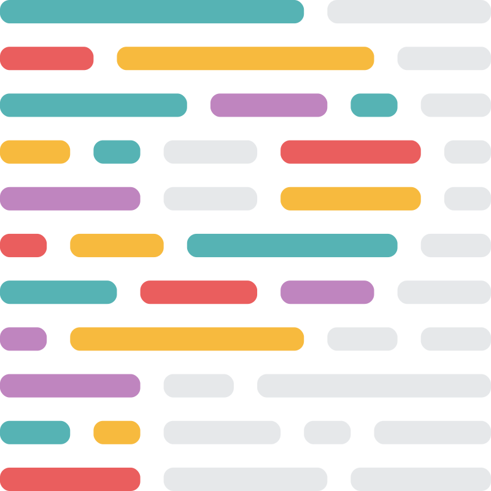
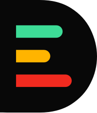
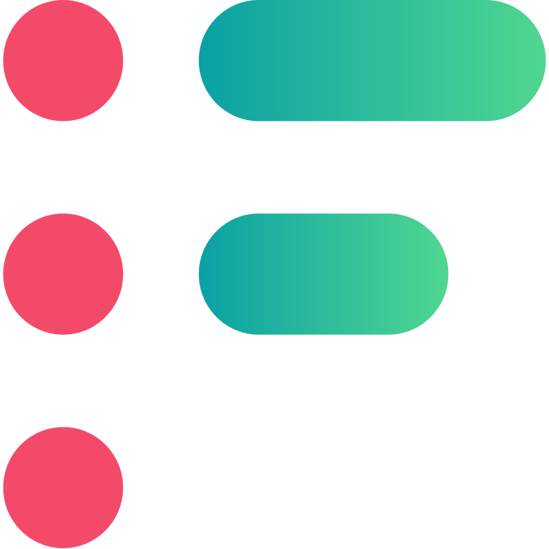

# 194 ARRAYS 🫠

## BADGES

### REPO INFO

### CODE FACTOR

### DEEPSOURCE

<!--  -->

## TOOL, PLATFORM, BOT, LANG

<!-- OLD SVG -->
<!-- 

    
    
    
    
    
    

 -->

    
    
    
    <!--  -->
    <picture>
        <source media="(prefers-color-scheme: dark)" srcset="img/icons8-github-for-darkmode.svg">
        <source media="(prefers-color-scheme: light)" srcset="https://cdn.jsdelivr.net/gh/devicons/devicon/icons/github/github-original.svg">
        
    </picture>
     
    
    
    
    
    <!--  -->
     
    
    

## INFO

Làm bài tập nhóm `194 arrays`

## MEMBERS

-   [Trần Nguyễn Thái Bình](https://github.com/KevinNitroG) _(23520161)_
-   [Trương Hoàng Khiêm](https://github.com/truonghoangkhiem) _(23520730)_
-    _()_
-    _()_
-    _()_
